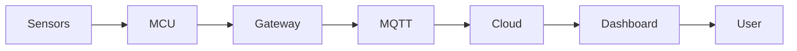

  

# 👋 Hello, I'm Kittisak Hanheam

💡 **AIoT Full Stack Developer | Embedded Systems | System Integration, Security & Deployment**

I enjoy building systems that connect **hardware, sensors, networks, software, and deployment workflows** to solve practical problems in the real world.

My background comes from **industrial electronics, embedded development, IoT systems, and hands-on R&D work**.  
Right now, I am exploring and strengthening my path in **IIoT, Rust, PLC, SCADA, and Industrial Automation** step by step.

---

## 🧑‍💻 About Me

My technical journey started from working with **electronics, field devices, and environmental monitoring systems**.

Over time, I moved deeper into **IoT development, embedded systems, and practical system integration**, with experience in areas such as:

- Sensor integration
- Microcontrollers
- Embedded programming
- Network connectivity
- IoT dashboards and monitoring systems
- Device deployment and field integration
- Security-aware system design for connected environments

Even though I did not graduate directly from an engineering faculty, I have built my skills through **real projects, practical work, R&D support, and continuous learning**.

---

## 🎓 Education

**Master’s Degree — Digital Technology**  
Sukhothai Thammathirat Open University *(2024 – Present)*

**Bachelor’s Degree — Computer Science**  
Sukhothai Thammathirat Open University *(2018 – 2023)*

**High Vocational Certificate — Industrial Electronics**  
Surin Technical College *(2014 – 2016)*

---

## 💼 Work Experience

### IoT Programmer — Enserv Powor Co., Ltd.
*(2024 – Present)*

- Smart Farm related development
- Sensor systems and research support tools
- Web UI and full-stack support
- ESP32 based automation prototypes
- Raspberry Pi based detection experiments

### IoT Project Engineer — eLOC8 Co., Ltd.
*(2024)*

- IoT solution development using ESP32 and Arduino
- LoRaWAN integration
- Real-time dashboard support
- Monitoring and tracking solutions

### IoT Developer — Security Pitch Co., Ltd.
*(2021 – 2024)*

- Embedded and IoT related R&D support
- CCTV and access control integration
- PCB design and embedded programming
- Raspberry Pi / Jetson Nano deployment support

### Electronics Design — 2S Tech (Thailand)
*(2019 – 2021)*

- PCB design
- BOM preparation
- Hardware testing and integration

### Technician — I&E Consultant Thailand
*(2016 – 2018)*

- Environmental monitoring support
- Air quality station maintenance
- Sensor and instrument service work

---

## 🧰 Technical Skills

### Embedded & Hardware
ESP32 • Arduino • Raspberry Pi • PIC

### Programming
C • C++ • Python • JavaScript • HTML • CSS

### Protocols & Connectivity
MQTT • Modbus RTU • RS-232 • RS-485 • Wi-Fi • BLE • HTTP • WebSocket • LoRaWAN

### Databases
MySQL • PostgreSQL • SQLite • MongoDB

### Tools & Platforms
ESP-IDF • Arduino IDE • Docker • Linux • VS Code • GitHub • OpenProject • Figma

### AI / Computer Vision
YOLO • MobileNet SSD • ONNX • ROS2 *(basic / practical exposure)*

---

## 🌱 Currently Exploring

I am currently exploring and improving in these areas:

- **IIoT** concepts and architectures
- **Rust** for systems and backend development
- **PLC and SCADA** for industrial automation workflows
- **Industrial Automation** and smarter monitoring systems
- Practical **system integration, deployment, and security-oriented thinking**

I prefer to describe these as **active growth areas**, not as expert-level skills yet.

---

## 🤖 Interest Areas

Topics I enjoy exploring:

- Embedded systems
- AIoT and connected devices
- Industrial IoT (IIoT)
- Industrial monitoring systems
- Smart farm and environmental sensing
- System integration and deployment
- Industrial automation and SCADA environments
- Edge AI experiments

---

## 🔬 Example System Direction

A simple architecture direction I am interested in:

---

## 🧪 Personal Projects / Lab Interests

- Sensor testing and prototyping
- ESP32 based monitoring systems
- Raspberry Pi experiments
- Dashboard and data visualization
- Learning-focused Rust and PLC projects
- Industrial integration practice and deployment experiments

---

## ⭐ Featured Project Ideas

- ESP32 Smart Farm Controller
- IoT Sensor Monitoring Dashboard
- Edge AI Person Detection Experiment
- Rust MQTT Learning Project
- LoRaWAN Environmental Monitoring
- PLC / SCADA Learning Integration Lab

> These represent the kinds of projects I am building or studying toward.

---

## 📊 GitHub Statistics

---

## 📈 Contribution Activity

---

## 👀 Visitor Counter

---

## 📫 Contact

📧 kittisak.hanheam@gmail.com

⭐ *I believe engineering grows through practice, curiosity, and continuous improvement.*
